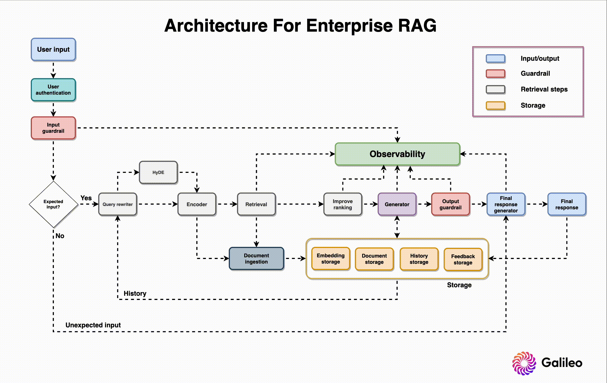

20240328 RAG

什么是RAG（Retrieval-augmented generation）
20240328 RAG

什么是RAG（Retrieval-augmented generation）



为什么需要RAG？

1. 模型无法精确记住信息（和人一样）

无论多少钱都没办法让模型精确记住所有信息

2. 信息太多了

什么是长上下文（Long Context）？

模型输入收到模型能力/模型训练/软硬件条件等多方面的限制

RAG与长上下文（Long Context）的关系，会互相代替吗？

模型能力的能力提高










https://towardsdatascience.com/12-rag-pain-points-and-proposed-solutions-43709939a28c

