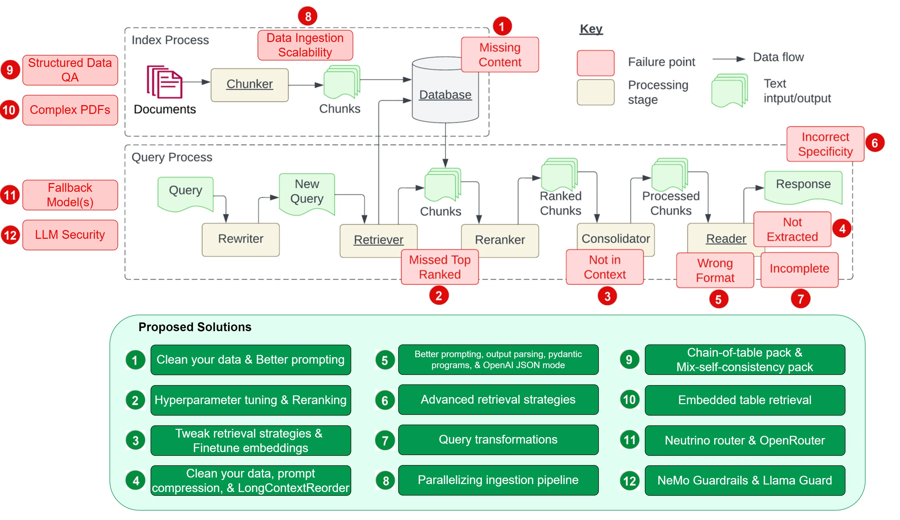

# 20240328 RAG 101

## 什么是RAG（Retrieval-augmented generation）


人是如何做RAG的

刘亦菲演过哪些电视剧

- 实时信息
- 准确信息

## 体验


https://github.com/ggerganov/llama.cpp/releases

https://huggingface.co/Qwen/Qwen1.5-14B-Chat-GGUF


./server -m ../models/qwen1_5-14b-chat-q4_k_m.gguf


```
<|im_start|>system
你是一个智能AI<|im_end|>
<|im_start|>user
2024年遵义校园冰雪运动会有多少人参加<|im_end|>
<|im_start|>assistant

```

```
<|im_start|>system
你是一个智能AI<|im_end|>
<|im_start|>user
基于下面的文档回答问题

3月27日，2024年遵义市校园冰雪运动会暨冰雪嘉年华活动在汇川区第三小学开幕，共有25个参赛单位600余名运动员参加。

本次活动由遵义市教育体育局主办、汇川区教育体育局承办，将开展陆地冰球、陆地冰壶、越野滑轮、速度轮滑四个项目的竞赛和交流体验，活动持续至29日。

据悉，冰雪运动是一项能增强学生身体协调性和专注力，培养耐心恒心，激发拼搏进取精神的体育运动项目。2021年以来，我市深化体教融合改革，新布局了冰雪项目高中高水平运动员基地学校4所、后备人才基地9个。
开展此次活动，将进一步向我市中小学生普及冰雪运动知识，为我市冰雪运动的推广，以及促进“全民健身”事业的发展贡献力量。

问题：2024年遵义校园冰雪运动会有多少人参加<|im_end|>
<|im_start|>assistant

```


## 为什么需要RAG？


1. 模型无法精确记住信息（和人一样）

无论多少钱都没办法让模型精确记住所有信息

2. 信息太多了


## 什么是长上下文（Long Context）？


- 模型输入受到模型能力/模型训练/软硬件条件等多方面的限制
- 长上下文 不等于 可以输出很长信息


## RAG与长上下文（Long Context）的关系，会互相代替吗？


为什么需要输入那么多信息？
- 模型无法精确记住所有信息
- 模型训练成本高
- 模型无法动态训练新信息


工程师永远要在不同的工作时，动态衡量










https://towardsdatascience.com/12-rag-pain-points-and-proposed-solutions-43709939a28c


# 流程梳理

构建 -> 召回 -> 生成

清晰的定义每一步的输入输出

## 构建

- 文档处理
  - 解析
  - 清理
  - 分块
- 向量模型
- 数据库存储
  - 向量数据库
  - 非向量数据库

## 召回

- 问题改写（扩写，回退等）
- 文档搜索召回
  - 粗排
  - 精排
  - 合并
  - 后处理
- 上下文筛选排序

## 生成

- LLM
  - Prompt
  - 微调
  - 部署
- 后处理

