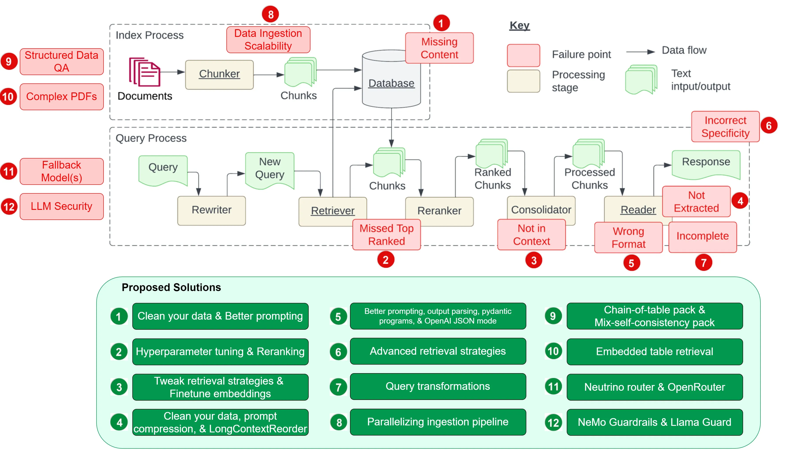

# 让我们构造一个极简的RAG

- 高级技巧会慢慢讲
- 会先从原始和基础把信息理清楚
- 着急的人，建议去看llamaindex和langchain的文档和代码

https://www.llamaindex.ai/

https://github.com/langchain-ai/langchain

## 上期回顾

下载llama.cpp预编译版本，或者编译它

https://github.com/ggerganov/llama.cpp/releases

下载模型

https://huggingface.co/Qwen/Qwen1.5-14B-Chat-GGUF

启动模型

./server -m ../models/qwen1_5-14b-chat-q4_k_m.gguf

服务器相关文档

## 让我们找一点数据

这里随便弄了一点股票相关数据

## 开始尝试没有RAG的问答

## 实现一个和你想象的可能不太一样的RAG问答

