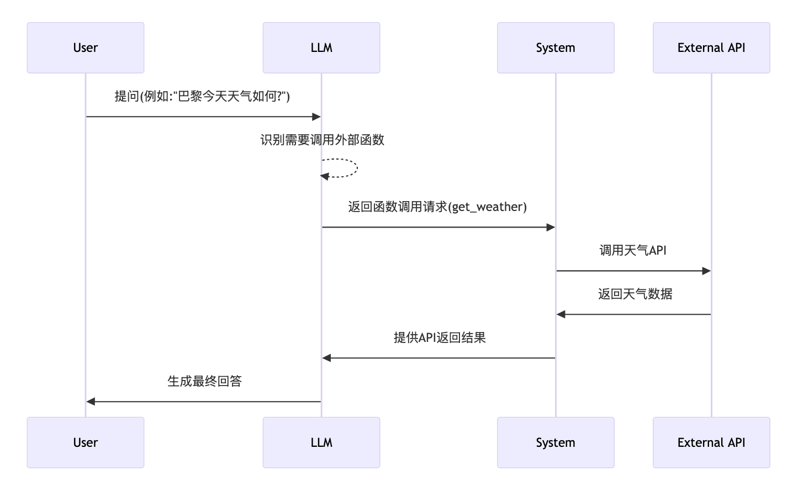

# LLM Cookbook 第七期  
## Function Calling
## 让大语言模型具备调用外部功能的能力
### 作者：AI匠  

---

# 本期内容

- **什么是Function Calling**
- **Function Calling的工作原理**
- **Function Calling的应用场景**
- **如何实现Function Calling**
- **Function Calling的最佳实践**

<!--  
欢迎来到LLM Cookbook第七期！今天我们将深入探讨Function Calling这一强大功能。
Function Calling允许大语言模型识别何时需要调用外部函数，并以结构化方式提供所需参数。
这项功能极大地扩展了LLM的能力边界，使其能够与外部工具和API无缝集成。
让我们一起学习如何利用这一技术，构建更智能、更实用的AI应用！
-->

---

# 什么是Function Calling

- **定义**：让LLM识别何时需要调用外部函数，并生成结构化的函数调用参数
- **本质**：是一种特殊的输出格式控制，生成标准化的JSON格式
- **意义**：弥补LLM知识边界的局限性，实现与外部世界的交互

<!--  
Function Calling本质上是一种特殊的输出格式控制技术。它使LLM能够识别用户请求中隐含的函数调用需求，并生成符合预定义结构的JSON格式输出。
这项功能的重要意义在于，它弥补了LLM固有知识的局限性，让AI系统能够获取实时信息、执行特定操作，从而提供更准确、更实用的服务。
简单来说，Function Calling就像是给LLM配备了一个"工具箱"，让它知道何时以及如何使用这些工具。
-->

---

# Function Calling的工作原理

<!--  
Function Calling的工作流程如下：
1. 用户向LLM提出问题，如"巴黎今天天气如何？"
2. LLM分析问题，识别出需要获取实时天气信息
3. LLM生成结构化的函数调用请求，指明函数名和所需参数
4. 系统接收这个请求，调用相应的外部API获取数据
5. 系统将API返回的数据提供给LLM
6. LLM基于获取的数据生成最终回答
这个过程使LLM能够突破知识边界，获取最新、最相关的信息。
-->

---

# Function Calling的应用场景

- **信息检索**：天气查询、股票价格、新闻资讯
- **数据处理**：数据分析、格式转换、数据可视化
- **系统集成**：日历管理、邮件操作、智能家居控制
- **工具调用**：计算器、翻译器、搜索引擎
- **业务流程**：预订系统、客户服务、订单管理

<!--  
Function Calling的应用场景非常广泛。在信息检索方面，它可以获取实时天气、股票价格等动态信息；在数据处理领域，它能执行复杂的数据分析和可视化任务；在系统集成方面，它可以与日历、邮件系统无缝对接；在工具调用方面，它能扩展LLM的基础能力；在业务流程中，它可以实现预订、客服等复杂交互。这些应用使LLM从单纯的对话系统转变为功能强大的智能助手。
-->

---

# 总结与展望

- **Function Calling的核心价值**
  - 扩展LLM能力边界
  - 实现与外部世界的交互
  - 提供更准确、实时的信息

- **未来发展方向**
  - 更复杂的工具调用链
  - 自动化工具选择和组合
  - 更深入的上下文理解和记忆

<!--  
总结一下，Function Calling极大地扩展了LLM的能力边界，使AI系统能够获取实时信息、执行特定操作，从而提供更准确、更实用的服务。
展望未来，我们可以期待更复杂的工具调用链，AI系统能够自动选择和组合多种工具来解决复杂问题，并且具备更深入的上下文理解和记忆能力。
Function Calling代表了AI从纯文本生成向真正智能助手转变的重要一步，它的潜力还远未被完全开发。
-->

---

# 实践建议

- **从简单场景开始**：先实现单一功能，如天气查询
- **逐步增加复杂度**：添加更多函数，处理更复杂的用户需求
- **关注用户体验**：确保整个过程对用户来说是自然流畅的
- **持续优化函数定义**：根据实际使用情况调整函数参数和描述
- **结合其他技术**：如RAG、Agents等，构建更强大的系统

<!--  
最后，给大家一些实践建议：
1. 从简单场景开始，掌握基本概念和流程
2. 逐步增加系统复杂度，添加更多函数和功能
3. 始终关注最终用户体验，确保交互自然流畅
4. 根据实际使用情况不断优化函数定义
5. 将Function Calling与其他先进技术结合，如检索增强生成(RAG)、智能代理(Agents)等，构建更加强大和智能的系统

希望本期内容对你有所帮助，感谢观看！
-->
