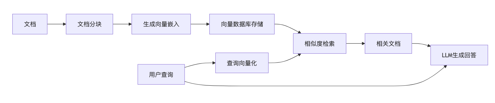

# LLM Cookbook 第八期
## RAG（向量工具篇）
### 作者：AI匠

RAG会有很多篇章，包括《向量工具篇》、《模型篇》、《切分chunking篇》、《提示词篇》、《数据库篇》等

<!-- 
大家好，我是AI匠，欢迎来到LLM Cookbook第八期！今天我们将探讨RAG技术中的向量工具。

RAG之后会有很多期不同的相关内容，介绍各方面的，我的介绍不能保证是最好的，也不能保证是最全的，更多的是介绍基本工具，给大家一个基本概念，至少是大部分情况下都基本够用的。
-->

---

# 本期内容

- **RAG技术概述** (Retrieval-Augmented Generation) 
- **Sentence Transformers**
- **Text Embeddings Inference (TEI)**
- **Ollama 嵌入模型**
- **Optimum + ONNX Runtime**

<!-- 
RAG (Retrieval-Augmented Generation) 是当前LLM应用的重要技术，它通过检索外部知识来增强生成内容的准确性和相关性。

本期我们聚焦于RAG技术栈中的向量工具部分，这些工具负责将文本转换为向量表示，是RAG系统的基础组件。

我们将介绍几种流行的向量工具，包括Sentence Transformers、TEI、Ollama嵌入模型以及Optimum与ONNX Runtime的组合方案。
-->

---

# RAG技术概述

- **RAG = Retrieval-Augmented Generation**
- **核心流程**：文档向量化 → 存储 → 检索 → 增强生成
- **向量工具的作用**：将文本转换为数值向量表示

<!-- 
RAG技术的核心流程包括：
1. 将文档分割成适当大小的块
2. 使用向量工具将这些文本块转换为向量表示
3. 将向量存储在向量数据库中
4. 当用户提问时，将问题也转换为向量
5. 在向量数据库中检索与问题向量最相似的文档向量
6. 将检索到的相关文档与原始问题一起发送给LLM
7. LLM根据问题和检索到的信息生成回答

在这个流程中，向量工具扮演着至关重要的角色，它们负责将文本转换为机器可理解的数值表示，使得相似度计算和检索成为可能。
-->

---

# Sentence Transformers

- **什么是Sentence Transformers?**
  - Python模块，用于生成高质量文本嵌入向量
  - 也称为SBERT (Sentence-BERT)
  - 由UKPLab创建，现由Hugging Face维护

- **主要特点**
  - 支持多语言
  - 易于使用和集成
  - 支持语义搜索、文本相似度计算等应用

<!-- 
Sentence Transformers是RAG应用中最常用的向量工具之一。它提供了一系列预训练的模型，可以将文本转换为高质量的向量表示。

这些向量能够捕捉文本的语义信息，使得我们可以通过计算向量之间的相似度来找到语义上相似的文本，这正是RAG系统所需要的核心功能。

Sentence Transformers的优势在于其易用性和灵活性，同时提供了大量高质量的预训练模型，适用于不同的应用场景和语言需求。
-->

---

# Sentence Transformers 使用示例

<pre><code>from sentence_transformers import SentenceTransformer
# 加载预训练模型
model = SentenceTransformer("all-MiniLM-L6-v2")
# 生成文本嵌入
sentences = [
    "这是第一个示例句子。",
    "这是与第一个句子相似的文本。",
    "这是一个完全不同的句子。"
]
embeddings = model.encode(sentences)
# 计算相似度
from sklearn.metrics.pairwise import cosine_similarity
similarity = cosine_similarity(embeddings)
print(similarity)
</code></pre>

<!-- 
这个示例展示了如何使用Sentence Transformers生成文本嵌入并计算句子之间的相似度。

首先，我们加载了一个预训练的模型"all-MiniLM-L6-v2"，这是一个轻量级但性能良好的模型。

然后，我们使用model.encode()方法将三个句子转换为向量表示。

最后，我们使用余弦相似度计算这些向量之间的相似性。结果会显示第一个和第二个句子的相似度较高，而与第三个句子的相似度较低，这符合我们的语义理解。

这个简单的示例展示了向量工具在RAG系统中的基本应用方式。
-->

---

# Text Embeddings Inference (TEI)

- **什么是TEI?**
  - 专为文本嵌入模型设计的高性能推理服务
  - 由Hugging Face开发的开源工具
  - 适合生产环境部署

- **主要特点**
  - 超高速推理
  - 支持多种部署方式（Docker、本地安装）
  - 支持多种硬件（CPU、CUDA、Metal）
  - 生产级特性（分布式追踪、指标监控）

<!-- 
Text Embeddings Inference (TEI)是Hugging Face开发的一个专门用于部署文本嵌入模型的高性能工具。与Sentence Transformers相比，TEI更专注于推理性能和生产部署。

TEI的设计目标是提供极高的推理速度，特别适合需要处理大量文本嵌入请求的生产环境。它支持多种部署方式和硬件平台，使得在不同环境中部署变得灵活。

TEI还提供了分布式追踪和指标监控等生产级特性，便于在大规模应用中进行监控和调试。
-->

---

# TEI 部署与使用

**Docker部署与调用示例:**
<pre><code>docker run --gpus all -p 8080:80 \
  ghcr.io/huggingface/text-embeddings-inference:0.6 \
  --model-id BAAI/bge-large-en-v1.5
</code></pre>

<pre><code>import requests
response = requests.post(
    "http://localhost:8080/embeddings",
    json={ "inputs": "这是一个需要向量化的文本示例。" }
)
print(response.json())
</code></pre>

<!-- 
TEI的部署和使用非常简单。这里展示了如何使用Docker部署TEI服务，并通过HTTP API调用它。

在Docker部署示例中，我们使用了BAAI/bge-large-en-v1.5模型，这是一个性能优秀的英文嵌入模型。TEI会自动下载并加载这个模型，然后在端口8080上提供服务。

在API调用示例中，我们通过简单的HTTP POST请求发送文本，然后获取返回的向量嵌入。这种API接口使得TEI可以轻松集成到各种应用中，无论是使用什么编程语言。

TEI的这种部署方式特别适合微服务架构，可以将嵌入服务作为独立的组件进行扩展和管理。
-->

---

# Ollama 嵌入模型

- **什么是Ollama?**
  - 本地运行大型语言模型的工具
  - 支持嵌入模型功能
  - 适合构建本地部署的RAG应用

- **主要特点**
  - 多种嵌入模型选择
  - 简单的API接口
  - 与LangChain、LlamaIndex等工具集成
  - 支持本地部署，无需云服务

<!-- 
Ollama是一个专注于本地运行大型语言模型的工具，它也提供了嵌入模型功能，使得构建完全本地部署的RAG应用成为可能。

与需要连接到云服务的解决方案不同，Ollama允许用户在本地环境中运行嵌入模型，这对于处理敏感数据或需要离线工作的场景特别有价值。

Ollama提供了多种嵌入模型选择，并且有简单的API接口，使得集成到现有应用中变得容易。它还与LangChain、LlamaIndex等流行的RAG工具框架有良好的集成。
-->

---

# Ollama 使用示例

**拉取模型与调用:**
<pre><code>ollama pull mxbai-embed-large
</code></pre>
<pre><code>import requests
response = requests.post(
    "http://localhost:11434/api/embeddings",
    json={
        "model": "mxbai-embed-large",
        "prompt": "这是一个需要向量化的文本。"
    }
)
embedding = response.json()["embedding"]
print(len(embedding))  # 向量维度
</code></pre>

<!-- 
使用Ollama进行文本嵌入非常简单。首先，我们需要使用`ollama pull`命令拉取所需的嵌入模型，这里我们使用了mxbai-embed-large，这是一个性能较好的嵌入模型。

然后，我们可以通过Ollama提供的HTTP API来获取文本的向量嵌入。在这个示例中，我们发送一个POST请求到Ollama的API端点，指定使用的模型和需要向量化的文本。

Ollama会返回一个JSON响应，其中包含生成的向量嵌入。我们可以直接使用这个向量进行后续的相似度计算或存储到向量数据库中。

这种简单的接口使得Ollama可以轻松集成到各种应用中，特别是那些需要在本地环境中运行的应用。
-->

---

# Optimum + ONNX Runtime

- **什么是Optimum?**
  - Hugging Face提供的模型优化工具
  - 用于加速模型推理，减小模型大小，显著提升推理速度
  - 支持多种硬件和后端

- **ONNX Runtime**
  - 高性能推理引擎
  - 支持多种硬件加速
  - 跨平台兼容性好

<!-- 
Optimum是Hugging Face提供的一个模型优化工具，它可以将Transformer模型转换为ONNX格式，并使用ONNX Runtime进行高效推理。

ONNX (Open Neural Network Exchange) Runtime是一个高性能的推理引擎，它可以在多种硬件平台上运行ONNX模型，包括CPU、GPU等。

将Optimum与ONNX Runtime结合使用，可以在不改变模型使用方式的情况下，显著提高推理性能。这种组合特别适合在生产环境中部署嵌入模型，可以获得更高的吞吐量和更低的延迟。

另一个重要优势是，ONNX的底层是C++，可以很容易被C++/Rust等语言集成，这使得在非Python环境中使用嵌入模型变得更加容易。
-->

---

# Optimum + ONNX Runtime 使用示例

<pre><code>from optimum.onnxruntime import ORTModelForFeatureExtraction
from transformers import AutoTokenizer
# 加载模型和分词器
model_id = "sentence-transformers/all-MiniLM-L6-v2"
model = ORTModelForFeatureExtraction.from_pretrained(
    model_id, export=True
)
tokenizer = AutoTokenizer.from_pretrained(model_id)
# 生成嵌入
text = "这是一个示例文本，用于生成向量嵌入。"
inputs = tokenizer(text, return_tensors="pt")
outputs = model(**inputs)
embedding = outputs.last_hidden_state.mean(dim=1)
print(embedding.shape)
</code></pre>

<!-- 
这个示例展示了如何使用Optimum和ONNX Runtime来加速嵌入模型的推理。

首先，我们使用ORTModelForFeatureExtraction类加载一个Sentence Transformer模型，并将其导出为ONNX格式。export=True参数表示如果ONNX模型不存在，则自动将PyTorch模型转换为ONNX模型。

然后，我们使用标准的Transformers API流程来处理文本并生成嵌入向量。这与使用原始PyTorch模型的代码几乎相同，但底层使用了ONNX Runtime进行推理，从而获得更好的性能。

这种方法的优势在于，它保持了与Transformers库的兼容性，同时提供了显著的性能提升。这使得将现有代码迁移到优化版本变得非常简单。
-->

---

# 向量工具对比

| 工具 | 优势 | 适用场景 |
|-----|------|---------|
| Sentence Transformers | 易用性高，模型丰富 | 研究、原型开发 |
| TEI | 高性能，生产级特性 | 大规模生产部署 |
| Ollama | 本地部署，隐私保护 | 敏感数据，离线应用，个人本地应用 |
| Optimum + ONNX | 跨平台，易集成 | 嵌入应用中，C++/Rust等编译环境 |

<!-- 
不同的向量工具有各自的优势和适用场景：

Sentence Transformers非常易于使用，提供丰富的预训练模型，特别适合研究和原型开发阶段，可以快速尝试不同的嵌入模型。

TEI专注于高性能推理和生产级特性，适合大规模生产部署，特别是需要处理大量请求的场景。

Ollama的主要优势在于本地部署和隐私保护，适合处理敏感数据或需要在离线环境中工作的应用。

Optimum与ONNX Runtime的组合提供了跨平台能力和易集成性，特别适合嵌入式系统或非Python环境，如C++或Rust应用。

选择合适的工具需要考虑项目的具体需求、资源限制和部署环境等多种因素。
-->

---

# RAG向量工具选择建议

- **考虑因素**
  - 性能需求（吞吐量、延迟）
  - 部署环境（云服务、本地服务器、边缘设备）
  - 数据隐私要求
  - 开发语言和框架
  - 模型更新频率

- **实践建议**
  - 原型阶段：使用Sentence Transformers快速验证
  - 生产部署：考虑TEI或Optimum+ONNX
  - 本地应用：选择Ollama本地部署
  - 混合策略：不同场景组合使用不同工具

<!-- 
在选择RAG向量工具时，需要考虑多种因素：

性能需求是首要考虑因素，包括系统需要处理的吞吐量和对延迟的要求。
部署环境决定了可用的计算资源和网络连接情况。
数据隐私要求可能限制某些云服务的使用。
开发语言和框架影响工具的集成难度。
模型更新频率决定了是否需要灵活更换模型的能力。

基于这些考虑，我们提出以下实践建议：

在项目的原型阶段，使用Sentence Transformers可以快速验证不同模型的效果。
对于生产部署，特别是高负载场景，TEI或Optimum+ONNX通常是更好的选择。
对于处理敏感数据的应用，Ollama的本地部署方案可以提供更好的隐私保护。
在复杂系统中，可以采用混合策略，在不同场景中使用不同的工具。
-->

---

# 总结与展望

- **本期要点**
  - 介绍了四种主流RAG向量工具
  - 分析了各工具的优缺点和适用场景
  - 提供了实际使用示例和选择建议

<!-- 
在本期LLM Cookbook中，我们详细介绍了RAG技术栈中的四种主流向量工具：Sentence Transformers、Text Embeddings Inference、Ollama嵌入模型以及Optimum与ONNX Runtime的组合。

我们分析了各工具的优缺点和适用场景，提供了实际使用示例和选择建议，希望能够帮助大家在实际项目中选择合适的向量工具。

在下一期中，我们将继续RAG系列，探讨RAG的其他方面
-->