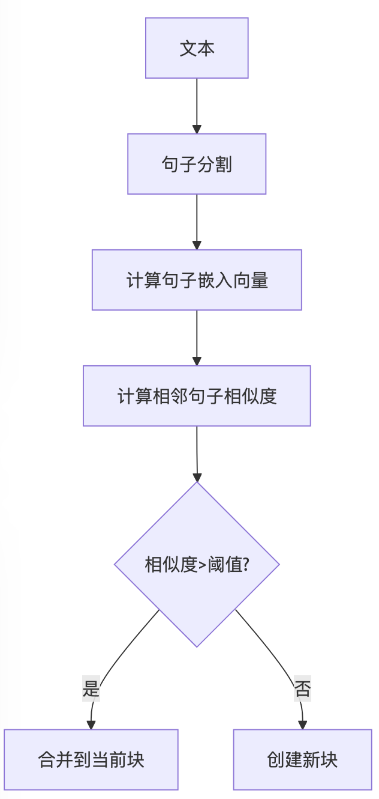

# LLM Cookbook 第十期
## RAG技术详解：Chunking篇
### 文本分块的艺术与科学

<!-- 
欢迎来到LLM Cookbook第十期！今天我们将深入探讨RAG（检索增强生成）技术中至关重要的一环：文本分块（Chunking）。
合理的分块策略能够显著提升检索质量和生成结果，让我们一起学习这门既是艺术又是科学的技术！
-->

---

# 本期内容

- **Chunking的重要性与基本原理**
- **主要分块策略**
  - 字符分块 (By Character)
  - 标记分块 (By Token)
  - 句子/段落分块 (By Sentence/Paragraph)
  - 递归分块 (Recursive Chunking)
  - 语义分块 (Semantic Chunking)
  - NSP分块 (Next Sentence Prediction)
  - 内容感知分块 (Content-Aware Chunking)
- **优化技术：重叠分块**
- **特殊文档分块：HTML、Markdown和结构化文档**
- **高级技术：父子文档检索（Parent-Child Retrieval）**

<!-- 
今天我们将系统地介绍文本分块的各种策略和技术，从最基础的字符分块到最先进的语义分块，并探讨如何处理特殊格式文档，以及通过重叠分块等技术进一步优化RAG系统的性能。
-->

---

# Chunking：RAG系统的关键环节

- **定义**：将长文本拆分成较小、可管理的片段
- **目的**：
  - 提高检索精度与相关性
  - 适应模型上下文窗口限制
  - 优化语义理解与匹配
- **影响因素**：
  - 块大小（太大或太小都会影响效果）
  - 分块方法（影响语义完整性）
  - 上下文保留（关键信息是否被分割）

<!-- 
文本分块是RAG流程中决定性的一步。不恰当的分块可能导致关键信息被割裂，或者检索到过多无关信息。选择合适的分块策略对RAG系统的整体表现至关重要。
-->

---

# 字符分块 (By Character)

- **原理**：按固定字符数量切分文本
- **优点**：
  - 实现简单直接
  - 块大小一致，便于管理
- **缺点**：
  - 可能切断语义单元
  - 忽略文本自然结构
- **适用场景**：
  - 字符级别的分析任务
  - 处理无明显结构的文本

<!-- 
字符分块是最简单的分块方法，但也最容易破坏文本的语义完整性。当我们按固定字符数切分时，句子和段落可能被任意截断，导致上下文信息丢失。
-->

---

# 标记分块 (By Token)

- **原理**：按LLM使用的标记（token）单位分块
- **优点**：
  - 与LLM处理单位一致
  - 便于控制上下文窗口利用率
- **缺点**：
  - 标记边界可能不符合自然语言结构
  - 需要使用分词器
- **适用场景**：
  - 直接输入LLM的文本
  - 需要精确控制token用量的场景

<!-- 
标记分块考虑了LLM的实际处理单位，但标记边界并不总是与自然语言的语义边界一致。例如，一个单词可能被分成多个标记，如果在边界处切分，可能导致单词被截断。
-->

---

# 句子/段落分块 (By Sentence/Paragraph)

- **原理**：按文本的自然句子或段落进行分块
- **优点**：
  - 保留文本的一定语义完整度，实现简单
- **缺点**：
  - 句子/段落长度差异大，可能导致块大小不均
  - 有些段落可能超出上下文窗口限制
- **适用场景**：
  - 结构化文档（论文、报告、文章）
  - 需要保持段落完整性的任务

<!-- 
段落分块是一种更自然的分块方法，它尊重文本原有的段落结构。这种方法在处理结构化文档时特别有效，因为段落通常是一个完整的语义单元。
-->

---

# 递归分块 (Recursive Chunking)

- **原理**：先按尝试按照大结构分块，再递归细分
- **优点**：
  - 更好的保留层次结构
- **缺点**：
  - 实现复杂度高
  - 需要定义多级分块规则
- **适用场景**：
  - 结构复杂的长文档（书籍、技术文档）
  - 需要多层次检索的应用
- **规则举例**：
  - 按页（pages），大空行（\n{3,}），空行（\n），句子标点（。！），句内标点（，），最终强制分

<!-- 
递归分块是一种高级策略，它尝试从大块的部分开始切分，逐渐缩小范围，并不能保证每一块的文本数量完全一致，但是可能更好的保留语义
-->

---

# 语义分块 (Semantic Chunking)

- **原理**：基于文本的语义相似性或主题变化进行分块
- **优点**：
  - 保持语义完整性和连贯性
  - 块边界与内容语义相关，而非机械切分
  - 提高检索相关性
- **缺点**：
  - 计算成本高
  - 依赖于语义模型的质量
- **实现方法**：
  - 使用嵌入模型计算语义相似度
  - 检测主题变化点
  - 应用自然语言处理技术识别语义边界

<!-- 
语义分块是最先进的分块方法，它关注文本的实际含义而非表面结构。通过分析语义相似性或主题变化，可以在保持语义完整性的同时进行更智能的分块。
-->

---

# NSP分块 (Next Sentence Prediction)

- **原理**：利用预训练语言模型的下一句预测能力进行分块
- **工作流程**：
  1. 使用预训练模型（如BERT）评估相邻句子的连贯性
  2. 当连贯性分数低于阈值时创建新块
  3. 保持高连贯性的句子组合在同一块中

- **优点**：
  - 基于深度语义理解进行分块
  - 能捕捉句子间的逻辑关系
  - 适应不同领域的文本风格

- **缺点**：
  - 计算成本较高
  - 依赖预训练模型质量
  - 实现复杂度高

<!-- 
NSP分块是一种基于深度学习的高级分块方法。它利用预训练语言模型对句子连贯性的理解，在语义转换点创建块边界。这种方法能够更好地保留文本的逻辑流，适合需要高质量语义理解的应用场景。
-->

---

# 内容感知分块 (Content-Aware Chunking)

- **原理**：根据文档的结构和内容类型进行智能分块
- **特点**：
  - 专为结构化文档设计（Markdown、LaTeX、HTML）
  - 识别并尊重文档的内在结构
  - 避免混合不同类型的内容元素

- **处理方式**：
  - 识别标题、代码块、表格、列表等结构元素
  - 保持相关内容的完整性
  - 为不同类型内容应用不同分块规则

- **优势**：
  - 保留文档的原始结构和语义
  - 提高特定内容类型的检索质量
  - 适合技术文档、教程等结构化内容

<!-- 
内容感知分块特别适合处理具有明确结构的文档。它能识别不同类型的内容元素，并确保每个块内的内容类型一致。例如，代码块不会被随意切分，表格会作为整体处理。这种方法在技术文档检索中特别有价值。
-->

---

# 重叠分块技术 (Chunk Overlap)

- **原理**：相邻块之间共享部分内容，避免信息在块边界处丢失
- **优点**：
  - 减少信息断裂
  - 提高跨块信息的检索率
  - 增加上下文连贯性
- **关键参数**：
  - 重叠大小（通常为块大小的10%-20%）
  - 重叠内容选择（句子完整性）

<!-- 
重叠分块是解决块边界信息丢失问题的有效技术。通过让相邻块共享一部分内容，可以确保跨块的信息（如跨段落的句子）不会在检索时丢失。重叠大小需要根据具体应用调整。
-->

---

# HTML文档分块策略

- **基于HTML结构的分块**：
  - 利用HTML标签自然层次
  - 按语义标签（`<section>`, `<article>`, `
`）分块
  - 保留标题与内容的关联

- **处理技巧**：
  - 提取并保留标题层次（h1-h6）作为元数据
  - 保持表格、列表等结构的完整性
  - 处理嵌入内容（如代码块、引用）

- **优势**：保留文档结构信息，提高检索精度

<!-- 
HTML文档包含丰富的结构信息，通过利用这些标签和层次结构，可以实现更智能的分块。例如，可以确保每个块都包含相关的标题，或者保持表格的完整性，从而提高检索质量。
-->

---

# Markdown文档分块策略

- **基于Markdown语法的分块**：
  - 利用标题层级（#, ##, ###）划分逻辑单元
  - 保持代码块、表格等特殊元素的完整性
  - 处理列表和引用块

- **实现方法**：
  - 标题驱动分块：每个标题及其内容形成一个块
  - 特殊处理代码块和数学公式

<!-- 
Markdown文档的分块可以充分利用其标题层级结构。通过识别不同级别的标题，可以创建层次化的块，并保留标题路径作为元数据，提高检索时的上下文理解。
-->

---

# 父子文档检索 (Parent-Child Retrieval)

- **核心思想**：
  - 存储小块（子文档）以提高向量表示精度
  - 检索时返回大块（父文档）以保留上下文

- **工作原理**：
  1. 将文档分割为小块（子文档）
  2. 为每个子文档生成向量嵌入
  3. 存储子文档与其父文档的映射关系
  4. 检索时匹配子文档，但返回父文档

<!-- 
父子文档检索是解决"小块精确检索"与"大块保留上下文"矛盾的优雅方案。通过维护子文档和父文档的映射关系，系统可以既利用小块的精确检索能力，又提供足够的上下文信息。
-->

---

# 父子文档检索的优势与实现

- **优势**：
  - 解决了块大小的两难困境
  - 提高检索精度同时保留上下文
  - 减少语义碎片化问题
  - 适应不同类型的查询需求

- **实现策略**：
  - **两级分块**：先创建大块（父文档），再细分为小块（子文档）
  - **元数据关联**：为每个子文档添加父文档ID和位置信息
  - **灵活配置**：可调整父文档和子文档的大小比例

- **应用场景**：
  - 长文档检索（书籍、报告、论文）
  - 需要精确定位但又需要广泛上下文的查询
  - 技术文档、法律文本等专业领域

<!-- 
父子文档检索技术在实践中非常灵活。可以根据具体需求调整父文档和子文档的大小，以及它们之间的层级关系。这种方法特别适合处理那些既需要精确检索又需要保留足够上下文的应用场景。
-->

---

# 分块策略选择指南

| 分块策略 | 适用场景 | 优先考虑因素 |
|---------|---------|------------|
| 字符分块 | 简单实现、无明显结构文本 | 实现简便性 |
| 标记分块 | 直接输入LLM的文本 | 与模型兼容性 |
| 段落分块 | 结构化文档、文章 | 语义完整性 |
| 递归分块 | 复杂长文档、技术文献 | 层次结构保留 |
| 语义分块/NSP分块 | 需要高质量语义理解的应用 | 语义连贯性 |
| 内容感知分块 | 结构化标记文档 | 内容类型完整性 |
| 父子文档 | 需要平衡精度和上下文的应用 | 检索质量与上下文平衡 |

<!-- 
选择合适的分块策略需要考虑多种因素。没有一种策略适合所有场景，最佳选择取决于具体应用需求、文档特性和资源限制。实际应用中往往需要通过实验比较不同策略的效果。
-->

---

# 性能评估与优化

- **评估指标**：
  - 检索准确率和召回率
  - 生成答案的相关性和完整性
  - 处理时间和资源消耗

- **常见问题与解决方案**：
  - **问题**：块太大，检索不精确
    - **解决**：减小块大小或使用语义分块
  - **问题**：块太小，上下文丢失
    - **解决**：增加重叠或使用父子文档检索
  - **问题**：关键信息被分割
    - **解决**：使用句子感知分块和实体保护

- **持续优化**：
  - 收集用户查询数据
  - A/B测试不同分块策略
  - 针对常见查询类型调整参数

<!-- 
分块策略的选择不是一次性决定，而是需要持续评估和优化的过程。通过监控系统性能，分析失败案例，可以不断调整分块参数和策略，提高RAG系统的整体表现。
-->
